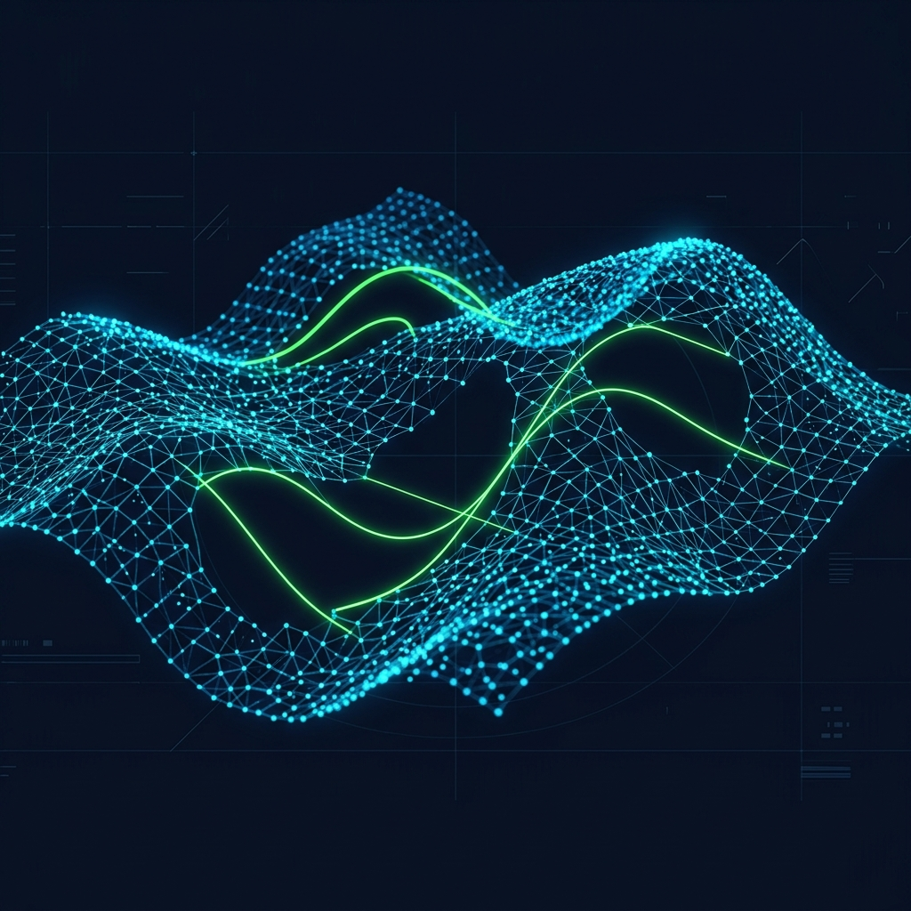
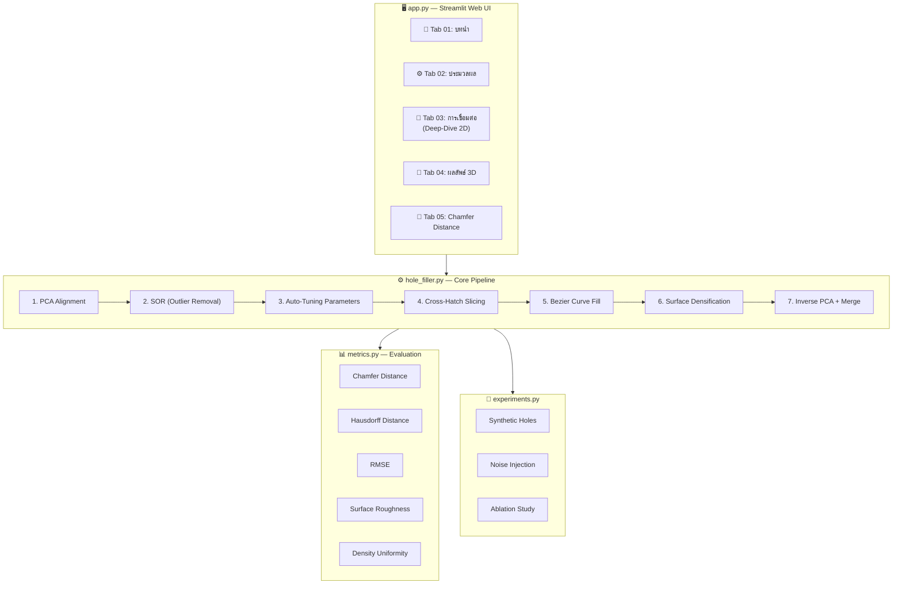

<p align="center">
  
</p>

<h1 align="center">🔬 3D Point Cloud Surface Reconstruction</h1>

<p align="center">
  <strong>Bezier Cross-Hatching</strong> — การซ่อมแซมรูโหว่บนพื้นผิว 3 มิติด้วยเส้นโค้ง Bezier แบบตาข่ายไขว้<br>
  พร้อมระบบ Surface Densification และ Automatic Parameter Tuning
</p>

<p align="center">
  
  
  
  
</p>

---

> **English Summary** — A research tool for repairing holes in 3D point cloud surfaces using dual-axis (cross-hatching) slicing and cubic Bezier curve interpolation. The pipeline includes PCA alignment, statistical outlier removal, automatic gap detection, G1-continuous Bezier filling, and surface densification. Achieves ~54% average Chamfer Distance improvement across 10 test files.

---

## 📋 สารบัญ

- [⚡ Quick Start](#-quick-start)
- [🎯 ภาพรวม](#-ภาพรวม)
- [🏗 สถาปัตยกรรมระบบ](#-สถาปัตยกรรมระบบ)
- [🔄 Pipeline — ขั้นตอนการทำงาน](#-pipeline--ขั้นตอนการทำงาน)
- [🧮 อัลกอริทึมหลัก](#-อัลกอริทึมหลัก)
- [📁 โครงสร้างไฟล์](#-โครงสร้างไฟล์)
- [🚀 การติดตั้ง](#-การติดตั้ง)
- [💻 การใช้งาน](#-การใช้งาน)
- [📊 ผลการทดสอบ](#-ผลการทดสอบ)
- [📏 Metrics ที่ใช้วัดผล](#-metrics-ที่ใช้วัดผล)
- [📝 ข้อจำกัดและแนวทางพัฒนา](#-ข้อจำกัดและแนวทางพัฒนา)
- [❓ Troubleshooting](#-troubleshooting)
- [📜 License](#-license)

---

## ⚡ Quick Start

```bash
# 1. ติดตั้ง
git clone <repository-url> && cd bezier_2B69
pip install -r requirements.txt

# 2. เปิด Web App
streamlit run app.py

# 3. หรือใช้ผ่าน CLI
python hole_filler.py Dataset/hole/H1.xyz -o output.xyz
```

> 📌 วางไฟล์ point cloud (`.xyz`, `.txt`, `.pts`) ไว้ใน `Dataset/hole/` แล้วเปิด Web App ที่ `http://localhost:8501`

---

## 🎯 ภาพรวม

โปรเจกต์นี้เป็นเครื่องมือวิจัยสำหรับ **ซ่อมแซมรูโหว่บนพื้นผิว 3D Point Cloud** ที่เกิดจากการสแกนไม่สมบูรณ์ โดยใช้แนวทาง:

1. **Cross-Hatching Slicing** — หั่น point cloud เป็นแผ่น 2D ตามแกน PCA สองแกน
2. **Cubic Bezier Curve** — สร้างเส้นโค้ง G1-continuous เชื่อมขอบรูแต่ละ slice
3. **Surface Densification** — เติมจุดระหว่างเส้น Bezier ให้ดูเป็นพื้นผิวจริง

ผลลัพธ์คือ point cloud ที่มีรูโหว่ถูกเติมเต็มอย่างเรียบ โดยมี **Chamfer Distance ลดลงเฉลี่ย ~54%** เมื่อเทียบกับ Ground Truth

### ✨ จุดเด่น

| Feature | รายละเอียด |
|---|---|
| 🎯 **PCA Tangent + Apex-Guided Hermite** | tangent ทิศทางจาก PCA (G1) + ระยะจาก apex projection + fallback gap/3 |
| 🧩 **Surface Densification** | สร้างเส้นกลาง + scatter จุดสุ่มสม่ำเสมอระหว่าง Bezier curves |
| ⚡ **Auto-Tuning** | Slice thickness, gap threshold, curve density ปรับอัตโนมัติจาก avg_point_spacing |
| 🌙 **Light/Dark Theme** | UI สลับ theme ได้ทันที พร้อม glassmorphism design |
| 🌡️ **3D Error Heatmap** | Chamfer Distance แสดงผลเป็น 3D heatmap บน point cloud จริง |
| 🧪 **Experiment Framework** | Synthetic holes, noise injection, ablation study, parameter sensitivity |

---

## 🏗 สถาปัตยกรรมระบบ



### คอมโพเนนต์หลัก

```
app.py (Streamlit UI)
  ├── hole_filler.py (Core Algorithm)   ← Pipeline ทั้งหมด
  ├── metrics.py (Evaluation)           ← Chamfer, Hausdorff, RMSE, Roughness
  ├── experiments.py (Research)         ← Synthetic holes, ablation
  └── slicer.py (File I/O)             ← Load .xyz/.txt/.pts files
```

---

## 🔄 Pipeline — ขั้นตอนการทำงาน

<details>
<summary><strong>Step 1: PCA Alignment</strong> — จัดแกนให้ตรงกับโครงสร้างหลัก</summary>

```
Input Point Cloud → Center (ลบ mean) → PCA → จัดแกนตาม Variance
```

- คำนวณ covariance matrix → eigenvectors (ใช้ `np.linalg.eigh`)
- จัดวาง: **PCA-X** = variance สูงสุด, **PCA-Y** = รอง, **PCA-Z** = ต่ำสุด (ความหนา)
- ทำให้การ slice ตรงกับโครงสร้างหลักของพื้นผิว
- Ensure right-handed coordinate system (`det(R) > 0`)

</details>

<details>
<summary><strong>Step 2: Statistical Outlier Removal (SOR)</strong> — กรอง noise</summary>

```
PCA Points → หา k-NN mean distance → ตัดจุดที่ > μ + 2σ
```

- ใช้ k=10 nearest neighbors (ปรับได้ผ่าน `sor_k`)
- คำนวณ mean distance ของแต่ละจุด
- กรองจุดที่อยู่ไกลผิดปกติ (threshold = `mean + std_multiplier × std`)
- ค่า `std_multiplier` default = 2.0 (ปรับได้ผ่าน `sor_std_multiplier`)

</details>

<details>
<summary><strong>Step 3: Auto-Tuning Parameters</strong> — คำนวณค่าอัตโนมัติ</summary>

```
Cleaned Points → cKDTree → avg_spacing → slice_thickness, gap_threshold
```

| Parameter | สูตร | ความหมาย |
|---|---|---|
| `avg_point_spacing` | ค่าเฉลี่ยระยะ 1st-NN (k=2) | ความห่างเฉลี่ยของจุด |
| `slice_thickness` | `avg_spacing × 2.0` | ความหนาของแต่ละ slice |
| `gap_threshold` | `avg_spacing × 5.0` | ระยะที่ถือว่าเป็น "รู" |
| `merge_distance` | `avg_spacing × 0.2` | ระยะสำหรับ dedup จุดใกล้กัน |

</details>

<details>
<summary><strong>Step 4: Cross-Hatch Slicing + Gap Detection</strong> — หั่นและหารู</summary>

```
PCA-X Slicing:  |---|---|---|---|---|  → detect gaps ในแต่ละ slice
PCA-Y Slicing:  ═══╤═══╤═══╤═══╤═══  → detect gaps ในแต่ละ slice
```

- สำหรับแต่ละแกน (X, Y):
  - แบ่งจุดตาม axis value เป็น slices
  - ในแต่ละ slice: sort จุดตามแกนที่ 2 → หา gap ที่ > threshold
  - Record: `(p_left, p_right, distance, axis_val)` สำหรับแต่ละรู
- **Deduplication**: ลบ gap pairs ซ้ำซ้อนที่ midpoint ใกล้กันเกินไป

</details>

<details>
<summary><strong>Step 5: Bezier Curve Gap Filling</strong> — เติมรูด้วย Bezier</summary>

#### 5.1 Tangent Estimation (PCA Eigenvector)
```python
# ใช้ PCA บน neighbor points เพื่อหา tangent direction
cov = np.cov(neighbors.T)
evals, evecs = np.linalg.eigh(cov)
tangent = evecs[:, -1]  # eigenvector with largest eigenvalue

# Orient tangent ให้ชี้เข้าหา gap
if np.dot(tangent, gap_dir) < 0:
    tangent = -tangent
```
**ข้อดี**: ใช้ PCA ทำให้ไม่มีปัญหา asymptote บนพื้นผิวแนวตั้ง (ต่างจาก polyfit)

#### 5.2 Apex-Guided Hermite Control Points
```
apex = ray intersection ของ tangent ทั้งสองฝั่ง
bulge_ratio = |apex - midpoint| / gap_length
curve_tension = 0.666 (ปรับลดลงถ้า bulge_ratio > 0.05)

# ฉาย apex ลงบน tangent ray เพื่อหา scale (รักษาทิศทาง G1)
scale_left  = dot(apex - P0, v_left)   # ถ้า ≤ 0 → fallback gap/3
scale_right = dot(apex - P3, v_right)  # ถ้า ≤ 0 → fallback gap/3

P1 = P0 + tension × scale_left × v_left
P2 = P3 + tension × scale_right × v_right
```
- **ทิศทาง**: ตาม PCA tangent เสมอ → **G1 จริงทุกกรณี**
- **ระยะ**: จาก apex projection → ปรับตัวตาม curvature ของพื้นผิว
- **Fallback**: ถ้า projection ไม่ valid → ใช้ gap/3 (สูตร Hermite มาตรฐาน)

#### 5.3 Cubic Bezier Curve
```
B(t) = (1-t)³·P0 + 3(1-t)²t·P1 + 3(1-t)t²·P2 + t³·P3
```
คุณสมบัติ: **G1 continuous** ที่ขอบรู (tangent ต่อเนื่อง)

</details>

<details>
<summary><strong>Step 6: Surface Densification</strong> — เติมจุดให้เป็นพื้นผิว</summary>

```
Slice N  : ────Bezier Curve────
             ↓ interpolate ↓
Middle   : ····interp curve····   ← เส้นกลางใหม่
             ↓ interpolate ↓  
Slice N+1: ────Bezier Curve────
             + scatter random pts ← จุดสุ่มสม่ำเสมอ
```

1. **Group** curves ที่อยู่ใน slice ติดกันและปิดรูเดียวกัน (proximity threshold = `avg_spacing × 30`)
2. **Resample** curves ให้มีจำนวนจุดเท่ากัน (arc-length interpolation)
3. **Interpolate** เส้นกลาง (linear lerp ระหว่าง curve pairs)
4. **Scatter** จุดสุ่มแบบ bilinear ในพื้นที่ quad ระหว่าง rails (ความหนาแน่นตาม `avg_spacing²`)

</details>

<details>
<summary><strong>Step 7: Inverse PCA + Merge</strong> — แปลงกลับและรวมจุด</summary>

```
PCA points → ×R^T + mean → Original space → Merge with distance check
```

- แปลงกลับจาก PCA space → พิกัดจริง
- Merge: จุดที่อยู่ใกล้กว่า `avg_spacing × 0.2` จะถูกรวม (average)

</details>

---

## 🧮 อัลกอริทึมหลัก

### Tangent Estimation: PCA Eigenvector

อัลกอริทึมหลักใน `hole_filler.py` ใช้ **PCA-based tangent estimation** โดย:

1. หา neighbor points ของจุดขอบรู (k=10)
2. กรองเฉพาะจุดที่อยู่ "ด้านหลัง" (ตรงข้ามกับ gap) เพื่อความแม่นยำ
3. คำนวณ covariance matrix → eigenvector ที่มี eigenvalue สูงสุดคือ tangent direction
4. ปรับทิศทางให้ชี้เข้าหา gap

**ข้อดี**: ไม่มีปัญหา math asymptote (infinity) บนพื้นผิวแนวตั้ง เหมือนกับ `polyfit`

### Apex-Guided Hermite Control Points + Auto Curve Tension

ใช้ **hybrid approach** รวมข้อดีของทั้ง Apex และ Hermite:

1. หา **apex** จาก ray intersection ของ tangent ทั้งสองฝั่ง
2. **ฉาย apex** ลงบน tangent ray เพื่อหา **scale** (รักษาทิศทาง → G1 จริง)
3. ปรับ **curve tension** อัตโนมัติ (0.666 → 0.216) ตาม bulge ratio
4. สร้าง control points: `Pi = endpoint + tension × scale × tangent`
5. ถ้า projection ≤ 0 → **fallback ใช้ gap/3** (สูตร Hermite มาตรฐาน)

| สถานการณ์ | การจัดการ | G1 |
|---|---|---|
| **Rays ตัดกัน (ปกติ)** | scale = apex projection, ผลเหมือน apex ดั้งเดิม | ✅ |
| **Apex ถูก clamp** | scale = ฤาย apex ที่ลดลง, แต่ทิศทางยังตาม tangent | ✅ |
| **Rays ขนาน / projection ≤ 0** | Fallback: gap/3 (Hermite มาตรฐาน) | ✅ |
| **Bulge ratio สูง** | ลด tension เพื่อลด wobbling | ✅ |

> **📌 หมายเหตุ**: ทั้งอัลกอริทึมหลัก (`hole_filler.py`) และ Tab 03 (การเชื่อมต่อ) ใน UI ใช้วิธี Apex-Guided Hermite เหมือนกัน

---

## 📁 โครงสร้างไฟล์

```
bezier_2B69/
├── app.py               # Streamlit UI (Light/Dark theme, 5 tabs)
├── hole_filler.py       # Core algorithm + CLI (PCA → SOR → Slice → Bezier → Densify → Merge)
├── metrics.py           # Chamfer, Hausdorff, RMSE, Roughness, Density Uniformity
├── experiments.py       # Synthetic holes, noise injection, ablation study
├── slicer.py            # File I/O (.xyz, .txt, .pts)
├── requirements.txt     # Dependencies
├── docs/
│   └── banner.png       # README banner image
└── Dataset/
    ├── hole/            # Input: point clouds WITH holes (H1.xyz ~ H10.xyz)
    └── before/          # Ground truth: COMPLETE point clouds (สำหรับ Chamfer Distance)
```

<details>
<summary><strong>📊 รายละเอียดไฟล์</strong></summary>

### ไฟล์หลัก

| ไฟล์ | หน้าที่ |
|---|---|
| `app.py` | Streamlit UI: 5 tabs, theme system, 2D/3D visualization, Chamfer Distance analysis |
| `hole_filler.py` | Pipeline ทั้งหมด: PCA, SOR, Slicing, Gap Detection, Bezier Fill, Densification, Merge + CLI |
| `metrics.py` | Quantitative metrics: CD, Hausdorff, RMSE, Fill Rate, Surface Roughness, Density Uniformity, Per-point Error |
| `experiments.py` | Synthetic hole generation, noise injection, parameter sensitivity, ablation study |
| `slicer.py` | โหลดไฟล์ point cloud (.xyz, .txt, .pts) |

</details>

---

## 🚀 การติดตั้ง

### Prerequisites
- Python 3.8+
- pip

### Setup

```bash
# Clone
git clone <repository-url>
cd bezier_2B69

# Virtual Environment (แนะนำ)
python -m venv venv
source venv/bin/activate    # Linux/Mac
# venv\Scripts\activate     # Windows

# Install Dependencies
pip install -r requirements.txt
```

### Dependencies

```
streamlit     — Web UI framework
plotly        — 3D/2D interactive visualization
numpy         — Numerical computing
pandas        — Data tables
scipy         — KDTree, cKDTree, spatial algorithms
scikit-learn  — (imported but used minimally)
```

### จัดเตรียมข้อมูล

วางไฟล์ point cloud ในโฟลเดอร์:

```
Dataset/
├── hole/          # ไฟล์ที่มีรู (input) — ต้องมี
│   ├── H1.xyz
│   └── ...
└── before/        # ไฟล์ต้นฉบับ (ground truth) — ไม่บังคับ, ใช้สำหรับ Chamfer Distance
    ├── H1.xyz
    └── ...
```

**รูปแบบไฟล์** (`.xyz` / `.txt` / `.pts`) — แต่ละบรรทัดมี x y z คั่นด้วย space:
```
x1 y1 z1
x2 y2 z2
...
```

---

## 💻 การใช้งาน

### 🖥️ Web Application (Streamlit)

```bash
streamlit run app.py
```
เปิดเบราว์เซอร์ไปที่ `http://localhost:8501`

| Tab | ฟังก์ชัน |
|---|---|
| **📍 01. บทนำ** | แสดง raw point cloud, ตั้งค่าขนาดจุด/โทนสี |
| **⚙️ 02. ประมวลผล** | กดปุ่ม "เริ่มประมวลผล" → รัน pipeline ทั้งหมด, ปรับ Slice Thickness / Gap Threshold ได้ |
| **🔗 03. การเชื่อมต่อ** | Deep-dive: ดู Bezier curve ทีละ slice (2D), เลือก gap/step ดูทีละขั้น |
| **💎 04. ผลลัพธ์** | แสดง 3D reconstruction, สลับ cross-hatch axes, download `.xyz` |
| **📐 05. Chamfer Distance** | 3D error heatmap, accuracy gauge, error distribution, metrics comparison |

### 🐍 Python API

```python
from hole_filler import process_point_cloud
from slicer import load_points_from_file
import numpy as np

# โหลดข้อมูล
points = np.array(load_points_from_file("Dataset/hole/H1.xyz"))

# ประมวลผล (auto-tune ทุกค่า)
result = process_point_cloud(points, verbose=True)

# ผลลัพธ์
merged = result['merged_points']        # point cloud ที่ซ่อมแล้ว
filled = result['combined_bezier_pts']  # เฉพาะจุดที่เติมใหม่

# บันทึก
np.savetxt("output.xyz", merged, fmt='%.8f')
```

#### ปรับค่าด้วยตนเอง

```python
result = process_point_cloud(
    points,
    slice_thickness=0.005,      # default: auto (avg_spacing × 2)
    gap_threshold=0.008,        # default: auto (avg_spacing × 5)
    num_points_per_gap=20,      # จุดต่อ gap (จะ auto ปรับตามขนาด gap)
    neighbor_k=5,               # k neighbors สำหรับ tangent estimation
    sor_k=10,                   # k neighbors สำหรับ SOR
    sor_std_multiplier=2.0,     # SOR threshold multiplier
    use_sor=True,               # เปิด/ปิด SOR (สำหรับ ablation)
    use_pca=True,               # เปิด/ปิด PCA (สำหรับ ablation)
    use_cross_hatch=True,       # เปิด/ปิด dual-axis (single-axis ablation)
    verbose=True,
)
```

<details>
<summary><strong>📋 API Reference — <code>process_point_cloud()</code> Return Dictionary</strong></summary>

| Key | Type | คำอธิบาย |
|---|---|---|
| `merged_points` | `ndarray (N, 3)` | Point cloud ที่ซ่อมแล้ว (original + filled, deduplicated) |
| `combined_bezier_pts` | `ndarray (M, 3)` | เฉพาะจุดที่เติมใหม่ (ทั้งสองแกนรวมกัน) |
| `bezier_pts_axis1` | `ndarray` | จุดที่เติมจากแกนหลัก (PCA-X) |
| `bezier_pts_axis2` | `ndarray` | จุดที่เติมจากแกนรอง (PCA-Y) |
| `original_inlier_points` | `ndarray` | จุดดั้งเดิมหลัง SOR (ใน original space) |
| `combined_boundary_pts` | `ndarray` | จุดขอบรูทั้งหมด |
| `gaps_axis1` | `list` | รายการ gap pairs แกน 1: `[(p_left, p_right, dist, axis_val), ...]` |
| `gaps_axis2` | `list` | รายการ gap pairs แกน 2 |
| `avg_point_spacing` | `float` | ค่า avg nearest-neighbor spacing |
| `slice_thickness` | `float` | ค่าที่ใช้จริง (auto หรือ manual) |
| `gap_threshold` | `float` | ค่าที่ใช้จริง |
| `num_filled` | `int` | จำนวนจุดที่เติมทั้งหมด |
| `rotation_matrix` | `ndarray (3, 3)` | PCA rotation matrix |
| `mean_pt` | `ndarray (3,)` | PCA centroid |
| `pts_clean_pca` | `ndarray` | จุดหลัง SOR ใน PCA space |
| `timings` | `dict` | เวลาแต่ละขั้นตอน: `pca`, `sor`, `auto_tune`, `gap_detection`, `fill`, `merge`, `total` |
| `inlier_mask` | `ndarray[bool]` | Mask จาก SOR |

</details>

### ⌨️ CLI (Command Line)

```bash
python hole_filler.py <input_file> [options]
```

| Option | Default | คำอธิบาย |
|---|---|---|
| `input` | (required) | ไฟล์ input `.xyz` / `.txt` |
| `-o, --output` | `<input>_filled.xyz` | ไฟล์ output |
| `--slice_thickness` | Auto | ความหนา slice |
| `--gap_threshold` | Auto | ระยะ gap threshold |
| `--num_points` | 20 | จุดต่อ gap (base) |
| `--neighbor_k` | 5 | k neighbors สำหรับ tangent |
| `--sor_k` | 10 | k neighbors สำหรับ SOR |
| `--sor_std` | 2.0 | SOR std multiplier |

**ตัวอย่าง:**
```bash
# Auto-tune ทุกค่า
python hole_filler.py Dataset/hole/H1.xyz -o output.xyz

# กำหนดค่าเอง
python hole_filler.py Dataset/hole/H5.xyz -o H5_fixed.xyz \
    --slice_thickness 0.005 --gap_threshold 0.008 --sor_k 15

# ลดความไว SOR
python hole_filler.py input.xyz --sor_std 3.0
```

---

## 📊 ผลการทดสอบ

### Chamfer Distance — Dataset 10 ไฟล์

<details>
<summary><strong>📋 ตารางผลลัพธ์ — คลิกเพื่อดู</strong></summary>

| File | Hole pts | Before pts | Merged pts | Filled pts | CD Input→GT | CD Repaired→GT | **Improvement** | RMSE | Time |
|---:|---:|---:|---:|---:|---:|---:|---:|---:|---:|
| H1 | 621 | 690 | 1,202 | 643 | 8.96e-06 | 2.61e-06 | **70.8%** | 0.00213 | 0.05s |
| H2 | 670 | 779 | 1,113 | 513 | 2.20e-05 | 6.73e-06 | **69.4%** | 0.00332 | 0.04s |
| H3 | 1,283 | 1,363 | 1,866 | 685 | 6.04e-06 | 3.33e-06 | **44.8%** | 0.00254 | 0.05s |
| H4 | 1,523 | 1,709 | 2,550 | 1,145 | 1.81e-05 | 3.97e-06 | **78.1%** | 0.00267 | 0.06s |
| H5 | 461 | 543 | 744 | 327 | 1.20e-05 | 3.83e-06 | **68.2%** | 0.00253 | 0.02s |
| H6 | 1,039 | 1,257 | 2,113 | 1,199 | 2.30e-05 | 5.54e-06 | **76.0%** | 0.00290 | 0.05s |
| H7 | 666 | 750 | 1,183 | 602 | 1.27e-05 | 8.32e-06 | **34.4%** | 0.00336 | 0.03s |
| H8 | 595 | 644 | 993 | 467 | 4.82e-06 | 5.42e-06 | **-12.4%** | 0.00300 | 0.03s |
| H9 | 490 | 554 | 774 | 323 | 8.70e-06 | 4.53e-06 | **47.9%** | 0.00309 | 0.02s |
| H10 | 1,148 | 1,447 | 2,824 | 1,851 | 2.90e-05 | 1.05e-05 | **63.8%** | 0.00386 | 0.07s |

</details>

### สรุปผล

| Metric | ค่า |
|---|---|
| 🏆 **CD Improvement เฉลี่ย** | **54.1%** (9/10 ไฟล์ดีขึ้น) |
| 📈 **CD Improvement สูงสุด** | **78.1%** (H4) |
| 📉 **กรณีแย่ลง** | H8 (-12.4%) — รูเล็กในพื้นที่ flat |
| 📐 **RMSE เฉลี่ย (จุดเติม)** | **0.00294** |
| ⚡ **เวลาประมวลผลเฉลี่ย** | **0.04s** |
| 🔢 **จุดเติมเฉลี่ย** | ~700 จุดต่อไฟล์ |

---

## 📏 Metrics ที่ใช้วัดผล

ระบบมี metrics ทั้งหมด 7 ตัวใน `metrics.py`:

| Metric | สูตร | ค่าดี | ใช้ดู |
|---|---|---|---|
| **Chamfer Distance** | `(1/\|A\|) Σ min\|\|a−b\|\|² + (1/\|B\|) Σ min\|\|b−a\|\|²` | ยิ่ง**ต่ำ**ยิ่งดี | ภาพรวมความใกล้เคียงของ point cloud สองชุด |
| **Hausdorff Distance** | `max(max min\|\|a−b\|\|, max min\|\|b−a\|\|)` | ยิ่ง**ต่ำ**ยิ่งดี | Worst-case error — จุดที่ไกลที่สุด |
| **RMSE** | `√(Σ dᵢ² / N)` | ยิ่ง**ต่ำ**ยิ่งดี | ความแม่นยำของจุดที่เติมใหม่ |
| **Fill Rate** | `filled / detected × 100%` | ยิ่ง**สูง**ยิ่งดี | สัดส่วนรูที่ถูกเติม |
| **Surface Roughness** | PCA eigenvalue ratio (smallest/total) per point | ยิ่ง**ต่ำ**ยิ่งดี | ความเรียบของพื้นผิว |
| **Density Uniformity** | CV ของ k-NN distances | ยิ่ง**ต่ำ**ยิ่งดี | ความสม่ำเสมอของจุด |
| **Mean Point Distance** | `mean(min\|\|a−b\|\|)` both directions | ยิ่ง**ต่ำ**ยิ่งดี | ระยะห่างเฉลี่ย (ไม่ยกกำลังสอง) |

---

## 📝 ข้อจำกัดและแนวทางพัฒนา

### ข้อจำกัดปัจจุบัน

| ข้อจำกัด | รายละเอียด |
|---|---|
| ❌ **H8 ได้ค่าแย่ลง** | เมื่อรูมีขนาดเล็กมากและอยู่ในบริเวณ flat การเติมจุดอาจเพิ่ม noise มากกว่าแก้ปัญหา |
| ⚠️ **Gap detection 1D** | ใช้ sorting 1D ตามแกน — ถ้าพื้นผิวมีรูปร่างซับซ้อน (undercut) อาจพลาด gap |

### แนวทางพัฒนาต่อ

- [ ] **Weighted regression**: ให้น้ำหนักจุดใกล้ขอบรูมากกว่า
- [ ] **Adaptive density**: ปรับ scatter points ตาม curvature ท้องถิ่น
- [ ] **Multi-scale slicing**: ใช้หลาย slice thickness สำหรับรูขนาดต่างกัน
- [ ] **Normal estimation**: เพิ่ม surface normal เพื่อ constrain Bezier
- [ ] **Implement alternative fill methods**: เพิ่ม linear, bspline, nearest เป็น alternative
- [ ] **2D gap detection**: ใช้ 2D Delaunay แทน 1D sorting เพื่อจับ undercuts

---

## ❓ Troubleshooting

<details>
<summary><strong>🔴 ไม่พบไฟล์ข้อมูลใน Dataset/hole/</strong></summary>

ตรวจสอบว่ามีโฟลเดอร์ `Dataset/hole/` และมีไฟล์ `.xyz`, `.txt`, หรือ `.pts` อยู่:
```bash
ls Dataset/hole/
```
ถ้ายังไม่มี ให้สร้างโฟลเดอร์แล้ววางไฟล์ point cloud ลงไป

</details>

<details>
<summary><strong>🔴 ModuleNotFoundError: No module named 'streamlit'</strong></summary>

```bash
pip install -r requirements.txt
```
หรือติดตั้งทีละตัว:
```bash
pip install streamlit plotly numpy pandas scipy scikit-learn
```

</details>

<details>
<summary><strong>🟡 ไม่เห็นผลลัพธ์ Chamfer Distance</strong></summary>

ต้องมีไฟล์ Ground Truth ในโฟลเดอร์ `Dataset/before/` ที่ชื่อตรงกับไฟล์ input (เช่น `H1.xyz`)  
ถ้าไม่มี Ground Truth ก็ยังรัน pipeline ได้ แต่จะไม่มี metrics comparison

</details>

<details>
<summary><strong>🟡 การประมวลผลช้ากับ point cloud ขนาดใหญ่</strong></summary>

- ลอง subsample point cloud ก่อน
- เพิ่ม `slice_thickness` เพื่อลดจำนวน slices
- ลด `neighbor_k` จาก default 5 เป็น 3

</details>

---

## 📜 License

MIT License — ใช้ได้ทั้งส่วนตัวและเชิงพาณิชย์ แก้ไขและแจกจ่ายได้ตามต้องการ

---

## 🙏 Acknowledgements

- **PCA / Spatial**: NumPy, SciPy (`cKDTree`, `KDTree`)
- **Visualization**: Plotly (interactive 3D/2D charts)
- **Web Framework**: Streamlit (rapid prototyping UI)
- **Fonts**: Inter, Sarabun (via Google Fonts)
- **Evaluation**: Chamfer Distance, Hausdorff Distance — standard 3D reconstruction metrics